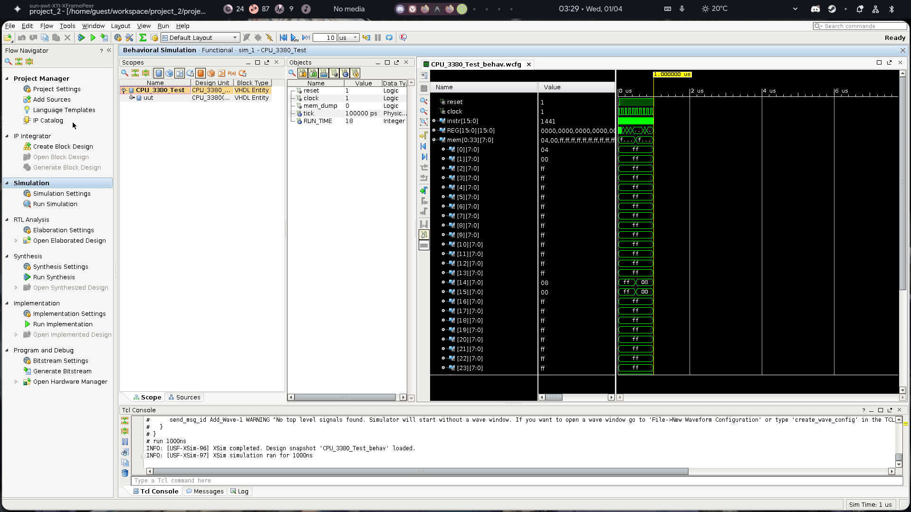

# Dockerized Xilinx FPGA Workspaces 🚀

A highly robust, containerized toolchain for natively running both **Xilinx Vivado** and the notoriously fragile legacy **Xilinx ISE 14.7 WebPACK** directly via Docker.

Running ancient hardware compilers on modern computers is a nightmare. This repository seamlessly encapsulates all the obscure Linux dependencies, graphics workarounds, and memory injection patches required to map the X11 GUI straight through the Docker isolation boundaries to your host computer.



## What's Inside

We have modularized our environments into two powerful containers:

### 1. `docker-vivado-webpack`
A hyper-clean, minimal Docker stack capable of running Vivado efficiently via mapped X11 sockets or through a customized headless `noVNC` web interface!

### 2. `docker-ise-14.7`
Xilinx abandoned ISE 14.7 in 2013. Getting it to natively execute on a modern Linux kernel requires completely disarming security measures. This container strictly applies the following "miracle" patches to force it to run:
* **`MALLOC_CHECK_=0`**: Suppresses modern `glibc` bounds checking which maliciously segmentation faults the `_pn` legacy VHDL parser engine (the *"free(): invalid next size (fast)"* core dump block).
* **`LC_ALL=C`**: Forces the ISE VHDL parser into pure ASCII mode to prevent X11 boundaries from reading UTF-8 characters as garbage Chinese symbols (`羐`).
* **`QT_X11_NO_MITSHM=1` & `_JAVA_AWT_WM_NONREPARENTING=1`**: Disables MIT Shared Memory to prevent Docker's strict IPC isolation from blinding the iSim QT waveform canvases and leaving massive unrendered grey rectangles on screen.
* **`batchxsetup` Bypass**: Bypasses the 10-year old interactive terminal EULA prompt (`yes "Y"`) and executes the 14.7 installer in fully unattended batch mode using proprietary Xilinx ini files.

## Prerequisites & Installation

Due to strict Xilinx software licensing, you must legally acquire and provide your own installer archives.

1. Download the massive installer TAR archives from Xilinx for Vivado and ISE.
2. Extract the installers into your workspace (the `Dockerfile` will actively mount and execute the extraction targets).
3. Ensure you have stripped any **Windows Carriage Returns (`\r`)** or **UTF-8 Non-Breaking Spaces (`\u00A0`)** from your existing VHDL source code, as the ISE parser will critically fail to parse them!
4. Navigate into your desired toolchain directory and build the container once:

```bash
docker compose build ise
```

5. Launch your graphic interface directly onto your X-Server (WSLg, VcXsrv, or native Linux X11)!
```bash
docker compose up ise-linux
```
